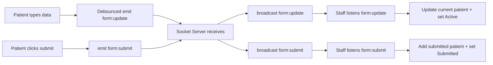

# Development Planning

เอกสารนี้อธิบายโครงสร้างโปรเจกต์ การออกแบบ UI/UX โครงสร้าง component และแผนผังการทำงานของระบบ Real-time ของโปรเจกต์ Live Form Monitor

## Project Overview

Live Form Monitor เป็นระบบลงทะเบียนผู้ป่วยและหน้าติดตามของเจ้าหน้าที่แบบ Real-time โดยแยกการทำงานเป็น 2 ส่วนหลัก

- `frontend` สำหรับหน้าคนไข้และหน้าเจ้าหน้าที่
- `socket-server` สำหรับรับและส่งต่อ event ระหว่าง client แบบทันที

## Scope of Features

### Patient View

- กรอกข้อมูลผู้ป่วยครบตาม requirement
- ตรวจสอบความถูกต้องของข้อมูลก่อน submit
- แสดง Summary หลังส่งฟอร์มสำเร็จ
- รองรับการใช้งานบนมือถือและเดสก์ท็อป

### Staff View

- แสดงข้อมูลที่ผู้ป่วยกำลังกรอกแบบ Real-time
- แสดงสถานะ Active, Inactive และ Submitted
- แสดงรายการผู้ป่วยที่ส่งฟอร์มแล้ว
- รองรับการใช้งานบนมือถือและเดสก์ท็อป

### Extra Features

- หน้า Home สำหรับเลือกโหมดการใช้งาน
- Debounce ก่อนส่งข้อมูลอัปเดต
- แสดงเวลาอัปเดตล่าสุดแบบ relative time
- ฟอร์มเดียวใช้งานได้ทั้งโหมดแก้ไขและโหมดอ่านอย่างเดียว

## Project Structure

```text
liveform-monitor/
	frontend/
  	src/
    	app/                    # Next.js routes (pages)
    	components/             # Reusable UI components
    	stores/                 # Zustand state management
    	services/               # Socket / API communication
    	lib/
     		socket/               # Socket client
    		validation/           # Form validation logic
  		types/                  # TypeScript types
  		consts/                 # Static options / enums
  		utils/                  # Helper functions (time, debounce)
	socket-server/
		index.js                  # Socket server (relay events)
```

## UI/UX Design Notes

- ใช้ card-centered layout เพื่อให้หน้าอ่านง่ายและโฟกัสกับข้อมูลหลัก
- ใช้สีและ spacing แยกแต่ละ section ชัดเจน เช่น form, status, list, summary
- แสดง error ราย field เพื่อให้แก้ไขได้เร็ว
- ใช้ read-only form ในหน้า staff เพื่อให้รูปแบบการแสดงผลสอดคล้องกับหน้า patient
- วาง layout ให้ responsive ด้วย grid และ breakpoint ของ Tailwind

## Component Architecture

- `PatientForm` เป็นฟอร์มหลักที่ reuse ได้ทั้ง Patient และ Staff View
- `FormField` รองรับ input, textarea และ select ใน component เดียว
- `StatusBadge` ใช้แสดงสถานะของข้อมูลคนไข้แบบ visual ชัดเจน
- `SummaryForm` ใช้แสดงข้อมูลหลัง submit พร้อมปุ่ม Reset
- `SubmittedList` ใช้แสดงรายการฟอร์มที่ถูกส่งแล้วและเวลาที่ส่ง
- `HeaderTitle` และ `BackButton` ใช้ทำ layout ส่วนหัวของแต่ละหน้าให้สม่ำเสมอ

## Data Flow

- ผู้ใช้พิมพ์ข้อมูลในหน้า Patient
- `PatientForm` ส่งค่ากลับไปที่ `patient/page.tsx`
- หน้า Patient ตรวจ validation ก่อน submit
- เมื่อพิมพ์ข้อมูล ระบบจะ emit `form:update` ผ่าน socket
- เมื่อกด submit ระบบจะ emit `form:submit`
- Socket server รับ event แล้ว broadcast ต่อไปยัง client อื่น
- หน้า Staff รับ event แล้วอัปเดต Zustand store เพื่อรีเฟรช UI ทันที

## Real-time Flow Diagram


